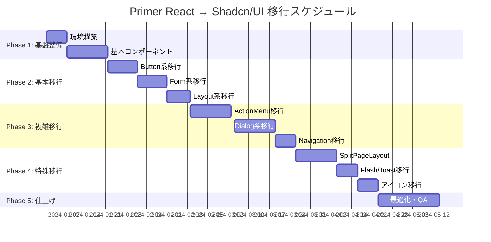

# GitHub Primer React から Shadcn/UI への移行計画書

## 📋 移行概要

### 目的
- モダンなUIライブラリへの移行によるDX向上
- バンドルサイズの最適化（20-30%削減予想）
- 将来性のあるエコシステムへの移行
- より柔軟なカスタマイズ性の獲得

### 移行対象
- **対象プロジェクト**: TaskFlow App (React 19.1.1 + TypeScript 5.7.3)
- **移行元**: GitHub Primer React 37.31.0 + @primer/octicons-react
- **移行先**: Shadcn/UI + Tailwind CSS + Lucide React

---

## 🔍 現状分析

### Primer React 使用状況
| コンポーネント | 使用ファイル数 | 移行難易度 |
|-------------|-----------|-----------|
| Button | 40+ | 🟢 低 |
| Text | 30+ | 🟡 中 |
| Box | 30+ | 🟢 低 |
| ActionMenu/ActionList | 20+ | 🟡 中 |
| FormControl/TextInput/Select | 15+ | 🟡 中 |
| IconButton | 15+ | 🟢 低 |
| @primer/octicons-react | 50+ | 🟡 中 |

### 特殊コンポーネント（高難易度）
- `SplitPageLayout` - 独自実装が必要
- `UnderlineNav` - Tabsコンポーネントで代替
- `Flash` - Alert/Toastシステムで代替
- `Banner` (experimental) - 独自実装

---

## 🗺️ コンポーネント対応表

### 基本コンポーネント
| Primer React | Shadcn/UI | 変更点 |
|-------------|-----------|--------|
| `Button` | `Button` | variant プロパティ調整 |
| `Text` | カスタム Typography | div + CN() での実装 |
| `Box` | `div + CN()` | Tailwind クラスで代替 |
| `IconButton` | `Button + Icon` | アイコン組み合わせ方式 |
| `TextInput` | `Input` | 直接対応 |
| `Select` | `Select` | 直接対応 |
| `Textarea` | `Textarea` | 直接対応 |
| `FormControl` | `Label + Field` | 構造変更 |

### 複雑コンポーネント
| Primer React | Shadcn/UI | 実装方法 |
|-------------|-----------|---------|
| `ActionMenu/ActionList` | `DropdownMenu` | 構造的変更 |
| `UnderlineNav` | `Tabs` | スタイル調整 |
| `Dialog` | `Dialog` | 直接対応 |
| `SplitPageLayout` | カスタム実装 | CSS Grid + Tailwind |
| `Flash` | `Alert/Toast` | 機能分割 |

### アイコンシステム
| Primer React | Shadcn/UI | 対応方法 |
|-------------|-----------|---------|
| `@primer/octicons-react` | `lucide-react` | アイコンマッピング表作成 |

---

## 🚀 段階的移行計画

### Phase 1: 基盤整備 (2-3週間)
```bash
# 環境構築
npm install @radix-ui/react-* tailwindcss lucide-react
npx shadcn-ui@latest init
```

**作業内容:**
- [ ] Tailwind CSS セットアップ
- [ ] Shadcn/UI 初期化
- [ ] 基本テーマ構築
- [ ] 共通コンポーネント移行開始

**対象ファイル:**
- `src/components/shared/` 配下の基本コンポーネント
- Button, Input, Select の移行

### Phase 2: 基本コンポーネント移行 (3-4週間)

**優先度1: Button系 (40+箇所)**
- `src/components/shared/LoadingButton.tsx`
- `src/components/shared/IconButton.tsx`
- Header, SubHeader のボタン群

**優先度2: Form系 (15+箇所)**
- `src/components/shared/Form/` 配下
- TaskForm, TemplateForm 関連

**優先度3: Layout系 (30+箇所)**
- Text, Box コンポーネントの Tailwind 置換

### Phase 3: 複雑コンポーネント移行 (4-5週間)

**Week 1-2: ActionMenu → DropdownMenu**
- `src/components/shared/Menu/UnifiedMenu.tsx`
- BoardActionMenu, ColumnActions 等

**Week 3-4: Dialog系**
- `src/components/shared/Dialog/UnifiedDialog.tsx`
- TaskCreateDialog, TaskEditDialog 等

**Week 5: Navigation系**
- SettingsDialog の UnderlineNav → Tabs
- DataManagementPanel のタブシステム

### Phase 4: 特殊コンポーネント移行 (3-4週間)

**Week 1-2: SplitPageLayout 再実装**
```tsx
// カスタム実装例
const SplitLayout = ({ sidebar, content }) => (
  <div className="grid grid-cols-[300px_1fr] h-screen">
    <aside className="border-r">{sidebar}</aside>
    <main className="overflow-auto">{content}</main>
  </div>
)
```

**Week 3: Flash → Alert/Toast システム**
- DialogFlashMessage の Alert 移行
- NotificationContainer の Toast 移行

**Week 4: アイコン完全移行**
- Octicons → Lucide React 一括置換

### Phase 5: 仕上げ・最適化 (2-3週間)

**Week 1: スタイル統一**
- デザイントークン調整
- レスポンシブ対応確認

**Week 2: 最適化**
- 未使用コード削除
- バンドルサイズ分析

**Week 3: QA・リリース準備**
- 総合テスト
- ドキュメント更新

---

## ⚙️ 技術的要件

### 依存関係の追加
```json
{
  "dependencies": {
    "@radix-ui/react-alert-dialog": "^1.0.5",
    "@radix-ui/react-button": "^1.0.4",
    "@radix-ui/react-dialog": "^1.0.5",
    "@radix-ui/react-dropdown-menu": "^2.0.6",
    "@radix-ui/react-form": "^0.0.3",
    "@radix-ui/react-tabs": "^1.0.4",
    "@radix-ui/react-toast": "^1.1.5",
    "class-variance-authority": "^0.7.0",
    "clsx": "^2.0.0",
    "lucide-react": "^0.294.0",
    "tailwind-merge": "^2.0.0",
    "tailwindcss": "^3.3.0",
    "tailwindcss-animate": "^1.0.7"
  }
}
```

### Tailwind CSS 設定
```js
// tailwind.config.js
module.exports = {
  content: ["./src/**/*.{js,ts,jsx,tsx}"],
  theme: {
    extend: {
      colors: {
        // TaskFlow カスタムカラー
        border: "hsl(var(--border))",
        input: "hsl(var(--input))",
        ring: "hsl(var(--ring))",
        background: "hsl(var(--background))",
        foreground: "hsl(var(--foreground))",
        primary: {
          DEFAULT: "hsl(var(--primary))",
          foreground: "hsl(var(--primary-foreground))",
        },
        // ... 他の色定義
      },
    },
  },
  plugins: [require("tailwindcss-animate")],
}
```

### 型定義の更新
```typescript
// src/types/ui.ts
export interface ButtonProps {
  variant?: 'default' | 'destructive' | 'outline' | 'secondary' | 'ghost' | 'link'
  size?: 'default' | 'sm' | 'lg' | 'icon'
  asChild?: boolean
}

// Migration compatibility types
export interface MigrationComponentProps {
  // Primer React互換プロパティ
  primerVariant?: 'primary' | 'secondary' | 'danger'
  // Shadcn/UI プロパティ
  shadcnVariant?: ButtonProps['variant']
}
```

---

## 🚨 リスク分析と軽減策

### 高リスク項目

#### 1. SplitPageLayout の独自実装
**リスク**: 複雑なレイアウト破綻
**軽減策**:
- CSS Grid による段階的実装
- 既存レイアウト仕様の詳細ドキュメント化
- レスポンシブ対応の徹底テスト

#### 2. アイコンシステム全面刷新
**リスク**: 50+種類のアイコン置換漏れ
**軽減策**:
```bash
# アイコンマッピング自動チェック
npm run icon-migration-check
```
- 完全なマッピング表作成
- 自動置換スクリプト作成
- ビジュアル差分チェック

#### 3. スタイリングシステム変更
**リスク**: デザインの一貫性喪失
**軽減策**:
- デザイントークン定義書作成
- ビジュアルリグレッションテスト導入
- デザイナーとの密な連携

### 中リスク項目

#### 1. ActionMenu → DropdownMenu 構造変更
**軽減策**: 段階的移行とコンポーネント互換レイヤー

#### 2. Form バリデーション動作変更
**軽減策**: 既存バリデーションロジックの保持

### 低リスク項目
- Button, Input, Select の基本プロパティ変更
- TypeScript 型エラー対応

---

## 🧪 品質管理計画

### テスト戦略

#### 1. ビジュアルリグレッションテスト
```bash
# Playwright でのビジュアルテスト
npm run test:visual
```
- 主要画面のスクリーンショット比較
- コンポーネント単位での差分チェック

#### 2. 機能テスト
- 既存の Jest + React Testing Library テスト維持
- インタラクションテスト強化
- アクセシビリティテスト

#### 3. パフォーマンステスト
```bash
# バンドルサイズ分析
npm run analyze
npm run lighthouse
```

### コードレビュー基準

#### チェックポイント
- [ ] Primer React import の完全削除
- [ ] Tailwind クラスの適切な使用
- [ ] TypeScript エラーの解消
- [ ] アクセシビリティ属性の保持
- [ ] レスポンシブデザインの維持

---

## 📅 スケジュール詳細



### マイルストーン
- **2024-01-21**: Phase 1 完了 - 基盤整備完了
- **2024-02-18**: Phase 2 完了 - 基本コンポーネント移行完了
- **2024-03-25**: Phase 3 完了 - 複雑コンポーネント移行完了
- **2024-04-22**: Phase 4 完了 - 特殊コンポーネント移行完了
- **2024-05-14**: Phase 5 完了 - 移行完了・リリース

---

## ✅ チェックリスト

### Phase 1: 基盤整備
- [x] Tailwind CSS インストール・設定
- [x] Shadcn/UI CLI セットアップ
- [x] 基本テーマ・CSS変数定義
- [x] 共通Button コンポーネント移行
- [x] 共通Input コンポーネント移行
- [x] TypeScript 型定義更新

### Phase 2: 基本コンポーネント移行
- [ ] LoadingButton 移行 (src/components/shared/)
- [ ] IconButton 移行 (src/components/shared/)
- [ ] Header ボタン群移行 (src/components/Header.tsx)
- [ ] SubHeader ボタン群移行 (src/components/SubHeader.tsx)
- [ ] Form系コンポーネント移行 (src/components/shared/Form/)
- [ ] TaskForm 関連移行
- [ ] TemplateForm 関連移行
- [ ] Text/Box → Tailwind 置換

### Phase 3: 複雑コンポーネント移行
- [ ] UnifiedMenu → DropdownMenu (src/components/shared/Menu/)
- [ ] BoardActionMenu 移行 (src/components/BoardActionMenu.tsx)
- [ ] ColumnActions 移行 (src/components/ColumnActions.tsx)
- [ ] TaskBoardMover 移行 (src/components/TaskBoardMover.tsx)
- [ ] FilterSelector 移行 (src/components/FilterSelector.tsx)
- [ ] UnifiedDialog 移行 (src/components/shared/Dialog/)
- [ ] TaskCreateDialog 移行
- [ ] TaskEditDialog 移行
- [ ] TemplateFormDialog 移行
- [ ] SettingsDialog タブ移行
- [ ] DataManagementPanel タブ移行

### Phase 4: 特殊コンポーネント移行
- [ ] SplitPageLayout カスタム実装
- [ ] SettingsDialog レイアウト適用
- [ ] DialogFlashMessage → Alert 移行
- [ ] NotificationContainer → Toast 移行
- [ ] Octicons → Lucide React マッピング表作成
- [ ] Feather → Lucide React マッピング表作成
- [ ] アイコン一括置換スクリプト実行
- [ ] 全アイコン使用箇所確認

### Phase 5: 仕上げ・最適化
- [ ] デザイントークン最終調整
- [ ] レスポンシブデザイン確認
- [ ] アクセシビリティテスト実行
- [ ] パフォーマンステスト実行
- [ ] バンドルサイズ分析・最適化
- [ ] 未使用 Primer React 依存関係削除
- [ ] ドキュメント更新 (README.md, CLAUDE.md)
- [ ] 総合QAテスト実行

### リリース準備
- [ ] プロダクションビルド確認
- [ ] Lighthouse スコア確認
- [ ] セキュリティ監査実行
- [ ] チーム向け移行ガイド作成
- [ ] ユーザー向けリリースノート作成

---

## 📞 サポート・問い合わせ

### 技術的サポート
- **Shadcn/UI 公式ドキュメント**: https://ui.shadcn.com/
- **Tailwind CSS ドキュメント**: https://tailwindcss.com/docs
- **Radix UI ドキュメント**: https://www.radix-ui.com/

### チーム内連絡先
- **プロジェクトリード**: [担当者名]
- **フロントエンド担当**: [担当者名]
- **デザイン担当**: [担当者名]

---

## 📝 変更履歴

| 日付 | バージョン | 変更内容 | 担当者 |
|------|-----------|---------|--------|
| 2024-10-24 | 1.0 | 初版作成 | Claude Code |

---

**注意**: この移行計画は現在のコードベース分析に基づいて作成されています。実際の移行作業では、各フェーズでの発見事項に応じて計画の調整が必要になる場合があります。
